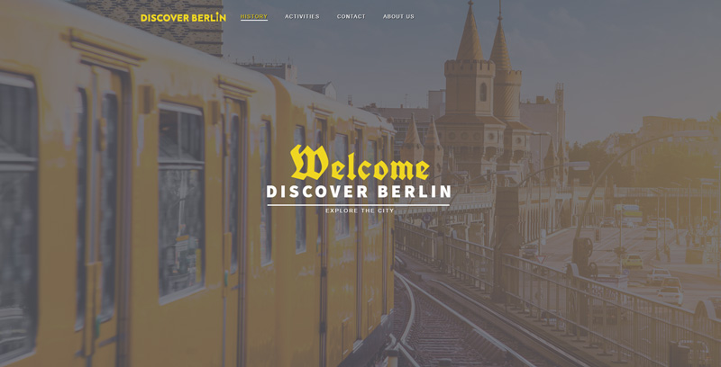
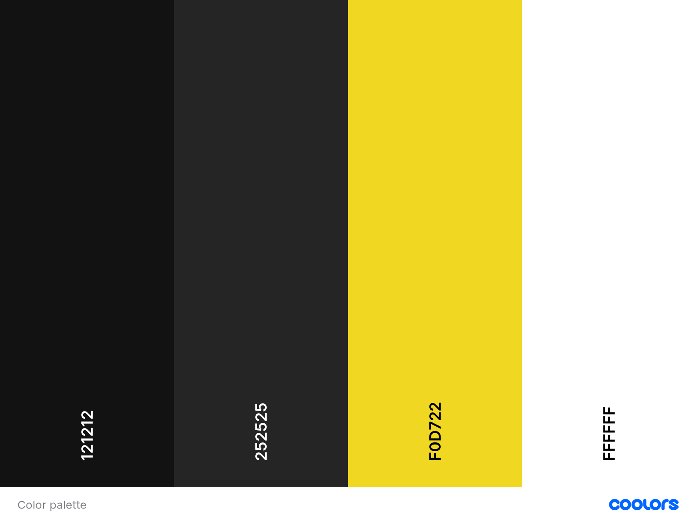
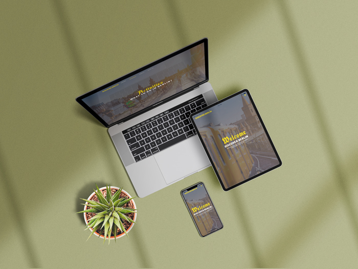

## Interactive User Frontend Development Milestone Project

# Discover Berlin

## Description

Discover Berlin is a website for English-speaking visitors who want to get closer to Berlin and its cultural offerings.

## UI/UX
### Project goals
Discover Berlin  is a milestone project for Code Institute User Centric Development module. The goal of this project is to provide useful information about Berlin. 
Above all, the user should get an overview of the activities on site.

### Structure
The navigation bar is on top of the page and fixed. The menu items are easy to understand. The logo is clickable and will take you back to the landing. The Navbar contains four Items: "History", "Activities", "Contact" and "About us". In the "History" section, the user receives a detailed contribution to the history of Berlin. "Activities" tab will take the user to a google map above of it he can make interactive selections. With a click on the picture markers appear on the map. The "Contact" tab leads to a contact form. And the "About us" Tab leads to the bottom of the active page. There is the footer with the "About us" area and the social icons.

## Design
### Colors
To build the design of the page I used simple Html, CSS, FontAwesome, Adobe Illustrator and Adobe Photoshop.
To design the logo and favicon I used Adobe Illustrator.

### Surface
When I think of Berlin, I always remember public transport. Especially the subway. The tram and subway are painted a bright yellow. This yellow dominates the style of the website.

### Fonts
The following google fonts were used:
* main-font: Source Sans Pro
* secondary-font: UnifrakturCook (Fraktur fonts were the most widely used publications in German-speaking countries for several centuries.)
* body-font: Cabin

### User Stories
Some users wanted:

* to be immediately sure if the website is credible and trustworthy.
* to have more targeted activity options to choose.
* to see more specific information about the activity places.
* to be able to to contact someone directly. For example: a club or restaurant.

## Features
### Existing Features
Users are able to:
* navigate through the site via Navbar, they can go to activities and use the different options
* find their location if the user allows to do so, otherwise it will take central Berlin as default. (It uses Google Places API to do that.)
* choose an activity by clicking one of the images, this will show activities or places like: Clubs, Parks, Restaurants, Museums Sports, Wellness .
*click markers on the map and underneath appears information such as address, website link and reviews.
* send me a message by using the contact form.

### Future Features
An area should be added where the user can book a guided tour.

## Technologies Used

* HTML
* CSS
* Javascript / jquery
* Google Fonts
* Google Places API
* Fontawsome
* Github and Gitpod
* Adobe Photoshop and Illustrator
* Google Crome Developer Tools
* Visual Studio Code

## Testing

Devices and browsers i used for testing:
* Iphone X 
    - Safari
    - Chrome
    - Brave 
* IPad Pro 13" MacOS
    - Safari
    - Chrome

* Windows 7 (Desktop PC 27" Screen)
    - Chrome
    - Firefox
    - Brave

### Validators

* [W3C HTML Validator](https://validator.w3.org/#validate_by_input) Passed tests without issues
* [W3C CSS Validator](https://jigsaw.w3.org/css-validator/#validate_by_input)
Passed tests without issues

## Deployment
This project was created with Visual Studio Code and Gitpod. 
Visit this [repository link](https://github.com/lemon-squeezy/discover_berlin) and click on the Clone or Download button to copy the link provided.

## Credits
### Images
* [Unsplash](https://unsplash.com/s/photos/berlin)
* [Pixabay](https://pixabay.com/de/images/search/berlin/)
### Text
The text in the history section was copied from [Wikipedia](https://de.wikipedia.org/wiki/Berlin).

## Disclaimer
This project is for educational purposes only.

## Acknowledgements
Special thanks to my mentor - Rhey Ann Magcalas